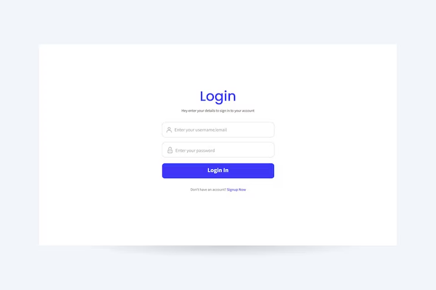

# Minimal White Login UI

A clean, responsive, minimal white login form interface built with HTML5, CSS3, and JavaScript.

## Preview



## Features

- 🎨 **Minimal & Modern Design**: Soft shadows, clean layout, vibrant blue accents.
- 📱 **Fully Responsive**: Adapts seamlessly to desktop, tablet, and mobile screens.
- 👁️ **Password Visibility Toggle**: Easily toggle password text visibility.
- ⚡ **Interactive Feedback**: Animated submit state with spinner and feedback alerts.
- 🔤 **Custom Typography**: Google Font *Plus Jakarta Sans*.

## Getting Started

Simply open `index.html` in any modern browser to view the login form.

```bash
# Clone the repository
git clone https://github.com/prakhardubey23/thirdproject.git

# Open index.html in your browser
```
